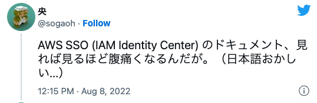
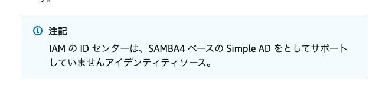
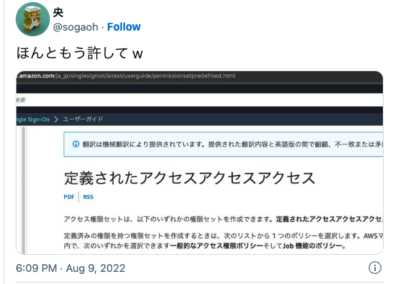

#### 余談
 

<table style="border:none;">
  <tr style="border:none;">
    <td style="border:none;"></td>
    <td style="border:none;"></td>
  </tr>
  <tr style="border:none;">
    <td colspan="2" style="text-align:center; border:none;"></td>
  </tr>
</table>

---

### 画像のみ

#### in a tag

